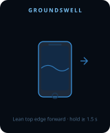
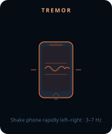
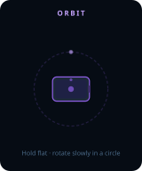
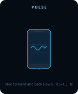
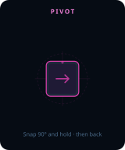
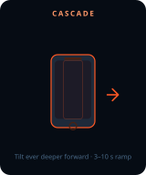

# GML

**Gyro Motion Language (GML)** — a framework that translates continuous gyroscope data (tilt, rotation, movement patterns) into meaningful shared digital experiences at scale.

## Motion Primitives

Eight distinct gestures turn every smartphone into an expressive instrument. The animations below show exactly how each movement should be performed.

<table>
<tr>
<td align="center" width="200">
   
  <strong>GROUNDSWELL</strong> 
  Lean top edge forward · hold ≥ 1.5 s 
  <i>Conviction · Momentum</i>
</td>
<td align="center" width="200">
   
  <strong>TREMOR</strong> 
  Shake rapidly left–right · 3–7 Hz 
  <i>Tension · Risk awareness</i>
</td>
<td align="center" width="200">
   
  <strong>ORBIT</strong> 
  Hold flat · rotate in a slow circle 
  <i>Alignment · Synthesis</i>
</td>
<td align="center" width="200">
   
  <strong>ANCHOR</strong> 
  Hold completely still · ≥ 3 s 
  <i>Resolve · Groundedness</i>
</td>
</tr>
<tr>
<td align="center" width="200">
   
  <strong>SURGE</strong> 
  Snap phone upward sharply · &lt; 0.5 s 
  <i>Excitement · Energy</i>
</td>
<td align="center" width="200">
   
  <strong>PULSE</strong> 
  Nod forward and back · 0.5–1.5 Hz 
  <i>Agreement · Active support</i>
</td>
<td align="center" width="200">
   
  <strong>PIVOT</strong> 
  Snap 90° yaw rotation · hold 1.5 s 
  <i>Reframing · Course correction</i>
</td>
<td align="center" width="200">
   
  <strong>CASCADE</strong> 
  Tilt ever deeper forward · 3–10 s ramp 
  <i>Escalation · Building pressure</i>
</td>
</tr>
</table>

## Full Component Reference

See [GML_COMPONENTS.md](./GML_COMPONENTS.md) for the complete structured specification of all eight motion primitives including detection logic, semantic meaning, and visualization ideas.

| Component | Axis | Threshold | Meaning |
|-----------|------|-----------|---------|
| **GROUNDSWELL** | Pitch forward | 15° · hold ≥ 1.5 s | Momentum, conviction, forward pressure |
| **TREMOR** | Roll lateral | 5° amplitude · 3–7 Hz | Tension, stakes, risk awareness |
| **ORBIT** | Yaw circular | 270° arc · 3–6 s/rev | Alignment, synthesis, convergence |
| **ANCHOR** | All axes | &lt; 1° deviation · ≥ 3 s | Stability, resolve, groundedness |
| **SURGE** | Pitch backward | ≥ 120°/s · &lt; 0.5 s | Excitement, enthusiasm, energy |
| **PULSE** | Pitch oscillation | 8–20° · 0.5–1.5 Hz | Agreement, affirmation, active support |
| **PIVOT** | Yaw snap | 80–100° · hold 1.5 s | Reframing, course correction, change of mind |
| **CASCADE** | Pitch deepening | +25° over 3–10 s | Escalation, urgency, building pressure |
